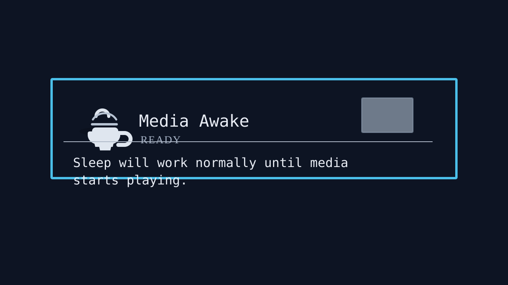

# Media Awake

An Omarchy shell plugin that prevents the screensaver and system sleep while
media is actively playing. When playback stops, normal Omarchy idle behavior
returns.



The plugin uses Quickshell's MPRIS integration, so it works with media players
and browsers that publish playback state through MPRIS, including Firefox and
Chromium-based browsers when their media integration is available.

The bar widget uses a coffee cup (`☕`) icon. Left-click it to open the status
popup and enable or disable Media Awake with the switch. Right-click toggles
the feature directly.

## Install

```bash
omarchy plugin add https://github.com/sumit-official/omarchy-media-awake.git --enable
omarchy bar put org.user.media-awake right
```

If the plugin is already installed but not enabled:

```bash
omarchy plugin enable org.user.media-awake right
```

Restart the shell only if the widget does not appear immediately:

```bash
omarchy restart shell
```

## Control from the terminal

```bash
omarchy-shell media-awake status
omarchy-shell media-awake enable
omarchy-shell media-awake disable
omarchy-shell media-awake toggle
```

## Update and remove

```bash
omarchy plugin update org.user.media-awake
omarchy plugin remove org.user.media-awake
```

## Development

Validate the plugin before publishing changes:

```bash
omarchy plugin validate .
```

The plugin is user-scoped and does not modify `/usr/share/omarchy/`.
